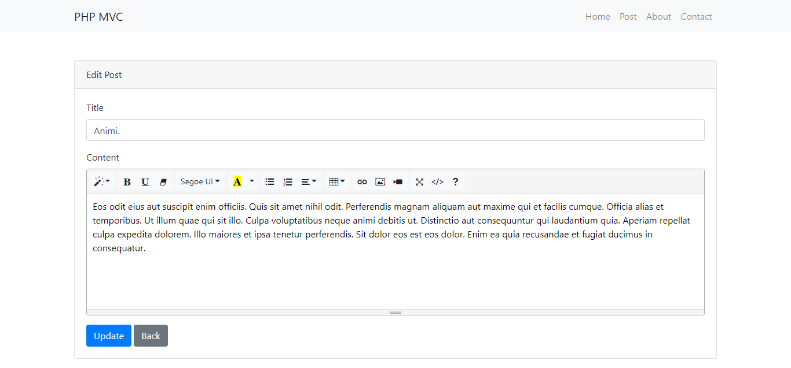

# PHP OOP MVC

Here is very simple sample blog project with PHP OOP using MVC Design Pattern to help for those
who is learning PHP and want to know who to how to build project using PHP OOP MVC Design Pattern.

### DEMO

__All Posts__


__Edit Post__



__Detail Post__


### Knowleadge

- Apache setting (.htaccess)
- Mysql

### Using PHP functions 

- call_user_func_array
- extract
- trim
- compact
- explode
- unset
- class_exists
- method_exists
- array_values

### Installation

- git clone
- config `core/config.php`
```
// Application 
define('APP_URL', 'http://localhost/php-oop-mvc/pubic');

// database
define('DB_HOST', 'localhost');
define('DB_USER', 'root');
define('DB_PASS', '');
define('DB_NAME', 'php_oop_mvc');
```
- composer install
- import db.sql
- entry point `public/index.php`
- 
